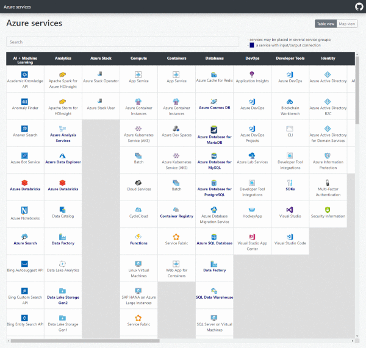

# Azure Services Map

A visual representation of Azure services.

Data pulled from [Azure Docs](https://docs.microsoft.com/en-us/azure/)
Map view and IO connection tree based on [D3](https://github.com/d3/d3) js framework.



Follow updates after [Sep 23 2019](https://azure.microsoft.com/en-in/updates/)

*Note: IE is not supported*

TODOs:
  - &#10003; rewrite code with Vue.js only
  - &#10003; metadata structure update to keep more related important url's for services
  - &#10003; filter for availability of services in different regions
  - &#9744; tacking of source doc pages changes for content maintenance purpose

## Project setup
```
npm install
```

### Compiles and hot-reloads for development
```
npm run serve
```

### Compiles and minifies for production
```
npm run build
```
