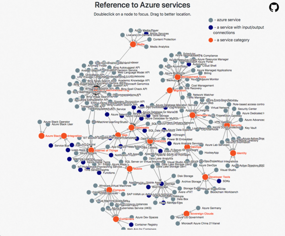

A visual representation of Azure services. Based on [D3](https://github.com/d3/d3) js framework.

Data pulled from [Azure Docs](https://docs.microsoft.com/en-us/azure/)

Follow updates after [February 2019](https://azure.microsoft.com/en-in/updates/)

TODOs:
  - rewrite code with Vue.js only
  - metadata structure update to keep more related important url's for services
